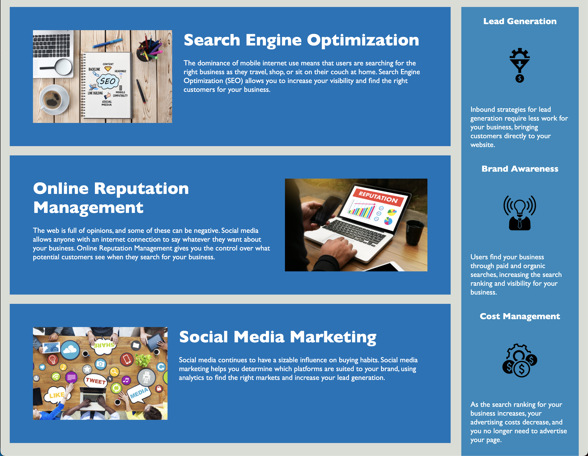

# Horiseon [HTML/CSS Code Refactor Challenge]

The purpose of this challenge was to refractor the given code to meet the given guidenlines.

## Grading Guidelines

```
Technical Acceptance Criteria: 40%
Satisfies all of the preceding acceptance criteria plus the following code improvements:
Application's links all function correctly.
Application's CSS selectors and properties are consolidated and organized to follow semantic structure.
Application's CSS file is properly commented.

Deployment: 32%
Application deployed at live URL.
Application loads with no errors.
Application GitHub URL submitted.
GitHub repository that contains application code.

Application Quality: 15%
Application resembles (at least 90%) screenshots provided in challenge instructions.

Repository Quality: 13%
Repository has a unique name.
Repository follows best practices for file structure and naming conventions.
Repository follows best practices for class/id naming conventions, indentation, quality comments, etc.
Repository contains multiple descriptive commit messages.
Repository contains quality README file with description, screenshot, and link to deployed application.
```

## User Story 

```
AS A marketing agency
I WANT a codebase that follows accessiblity standards
SO THAT our own site is optimized for searchengines
```

## Acceptance Criteria

```
GIVEN a webpage meets acessibility standards
WHEN I view the source code
THEN I find semantic HTML elements
WHEN I view the structure of the HTML elements
THEN I find that the elements follow a logical structure independent of styling and positioning
WHEN I view the image elements
THEN I find accessible alt attributes
WHEN I view the heading attributes
THEN they fall in dwquential order
WHEN I view the title element
THEN I find a  concise, decriptitve title
```

## Screenshot of Application




## TL;DR

Keep DRY in mind by reducing redundant code 

Group likewise code together to keep format clean and consistent

Use comments to help organize and explain how sections work